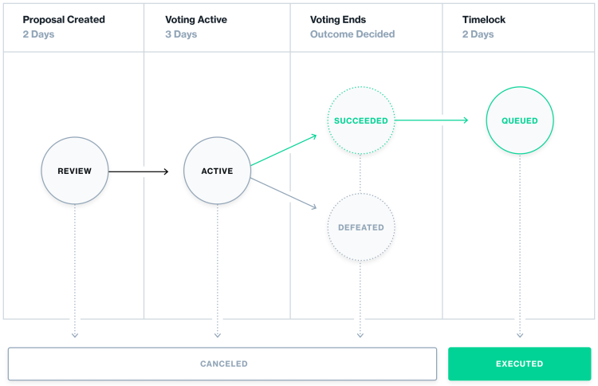

# The State of Governance

How are smart contract protocols governed today? Fortunately, as with many things in the EVM contract system, governance has started begun to standardize! The Compound protocol kicked off this standardization with their release of the Governor Alpha contract and the subsequent Governor Bravo. These contracts, when combined with an ERC20 token that supports them, can create a governance system described in the image below:

A new, executable proposal can be created which could be anything from a financial allocation from a shared treasury to a smart contract protocol upgrade. This proposal is voted upon by token holders and, if the minimum voting thresholds are reached, the vote will be queued for eventual execution. Variables like the length of voting, timelock delay, and voting thresholds (turnout & quorum) can be configured to meet the needs of the protocol.

We're going to be experimenting with the Governor standard from OpenZeppelin in an upcoming guide. This guide will teach you how to set the mint function of your ERC20 token to a function governed by a set of token holders!

## On-Chain Dashboard

Because of this standardization it is possible to see rich dashboards being created for smart contract governance like Tally. Tally displays on-chain data about proposals that are going through in the ecosystem today. Explore this dashboard to see which protocols are being governed, what decisions are being made and by whom!

## Off-Chain Temperature Checks

Another great tool for community governance is off-chain voting. Often times it is helpful to be able to poll the community to get a feel for what the community wants before building an executable proposal on-chain. Snapshot is a great tool for such a use case. By taking a snapshot of community token balances at a certain block height, they can freeze voting weights for a poll. Then, by collecting signatures (which can be verified which just public key cryptography!) they can authenticate how the token holders are voting.
